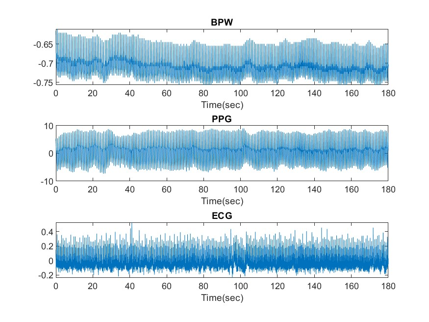
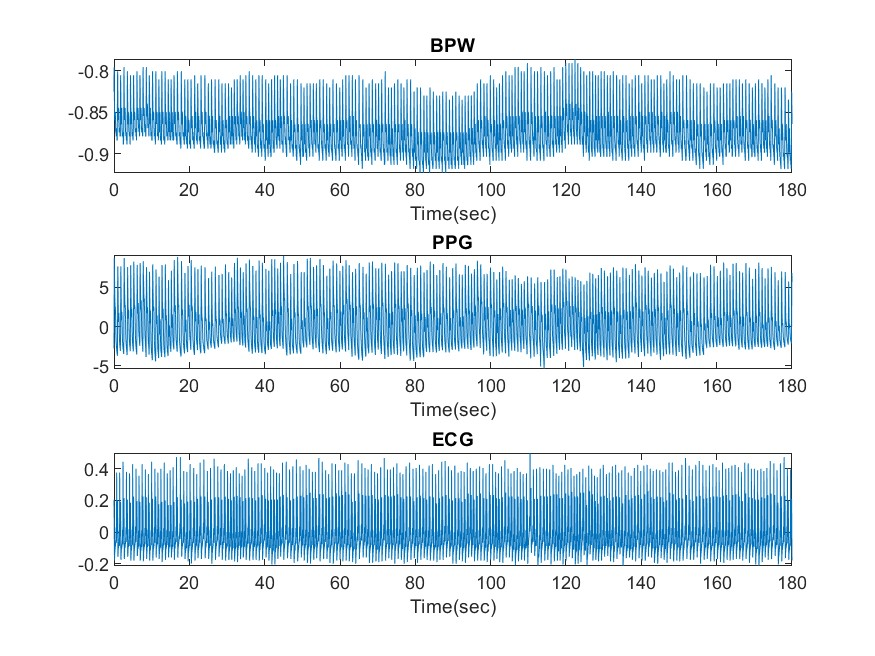

# HW1 - Loading

Using `Matlab` to load the data of ECG, PPG and BPW.

## [Code - HW1_1.m](HW1_1.m) 

## Data

Num of Data: 10

```text
%% Load data 1~10 (binary file)
    % data type: float 
    % channel number: 8
    % time: 0 ~ 180 sec
    % sampling number: length(data)/8
```

## Result



