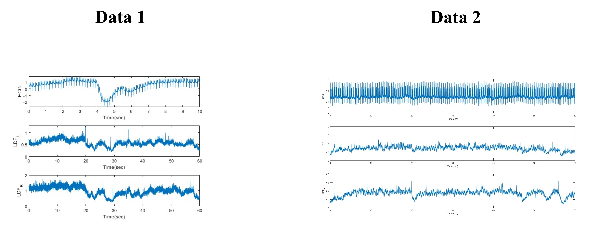
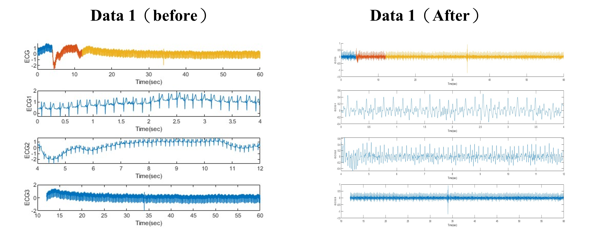
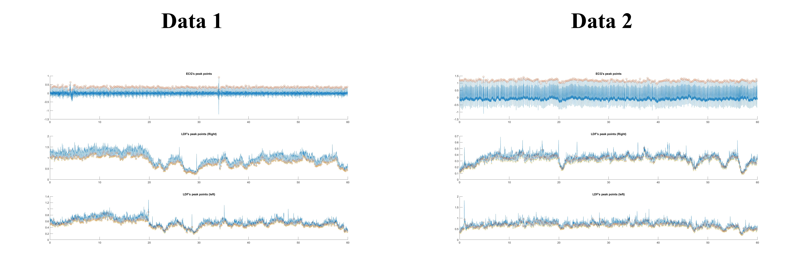
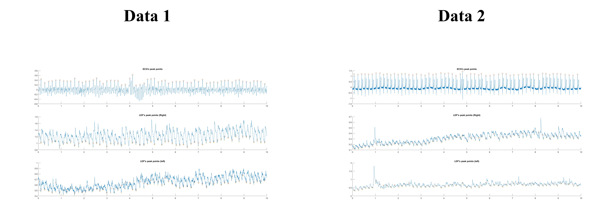

# HW10 LDF - 1

**Laser Doppler flowmetry** is a blood flow measurement method based on the Doppler shift of NIR light scattered by moving red blood cells.

## Signal characteristics of LDF:

* Quasi-periodic
* Low frequency content
* Poor waveform qualit

## Cut pressure 

With the assistance of other signals, ex: ECG and PPG with a searching window to find the foot points.

### Method

    ```text
    %% Find R Peak with window
    R=400;
    R_n=[];
    while(R < length(ECG_filter))
        index1 = R - 400;
        index2 = R + 400;
        if index1 < 1
            index1 = 1;
        end
        if index2 > length(ECG_filter)
            index2 = length(ECG_filter);
        end
        [peak,indexs] = max(ECG_filter(index1:index2));
        index = max(indexs)+index1-1;
        R_n = [R_n,index];
        R = index + 800;
    end
    
    %% Find Foot of LDF with ECG's R points
    F_n_R = findFP(LDF_R,R_n);
    F_n_L = findFP(LDF_L,R_n);
    ```

### Result

1. Original signal

    

2. separate signal & bandpass

    

3. Cut pressure

    

    
