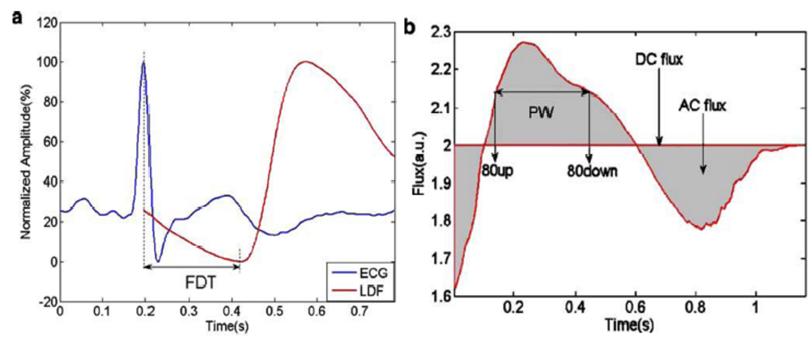
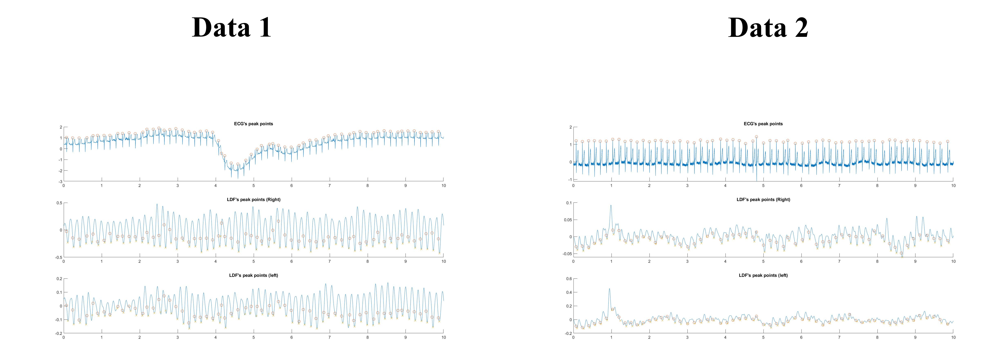
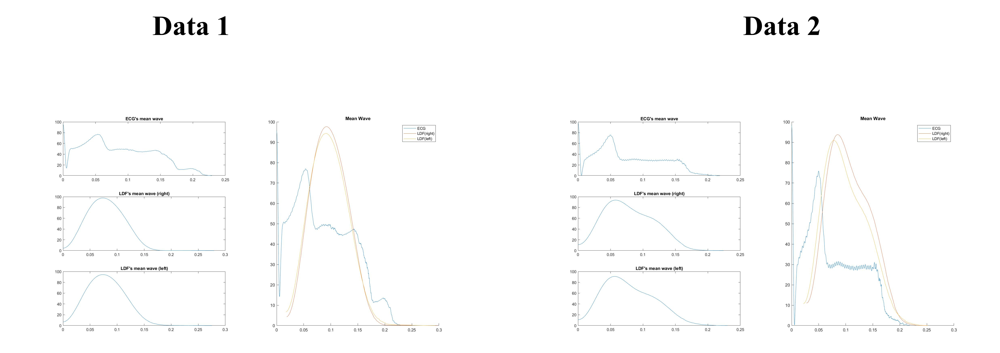
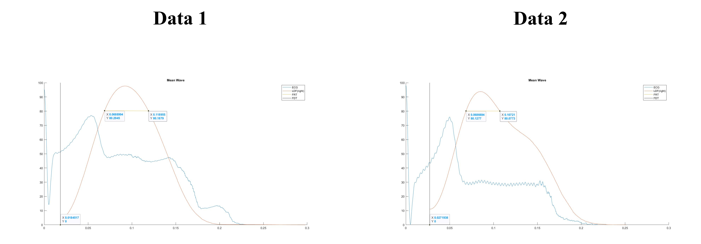

# HW11 LDF - 2

Average waveform analysis:

1. Cut pressure
2. Vertical axis normalization
3. Horizontal alignment to the average waveform
4. Obtain an average waveform

## Method

1. Cut pressure

    With the assistance of other signals, ex: ECG and PPG with a searching window to find the foot points.

2. Vertical axis normalization

    Normalize all pulse amplitudes to 100%.


3. Horizontal alignment to the average waveform

    Take the average of all pulses (Resample).

4. Obtain an average waveform

    Calculate various parameters.

    * DCflux
    * ACflux
    * PW: pulse width
    * FRT: flow rising time
    * FDT: foot delay time

    

### Average wave

    ```text
    %% Average wave
    ECG_m = averageWave(ECG_filter,R_n);
    LDF_Rm = averageWave(LDF_Rf,F_n_R);
    LDF_Lm = averageWave(LDF_Lf,F_n_L);
    ```

### Analysis mean wave

    ```text
    %% Analysis mean wave
    FDT = floor(mean(F_n_R - R_n));
    FR_80 = find(floor(LDF_Rm) == 80);
    FRT = max(FR_80)-min(FR_80);
    ```

## Result

1. ECG peak& LDF peak point

    

2. Average waveform

    

3. Analysis FDT & FRT

    

