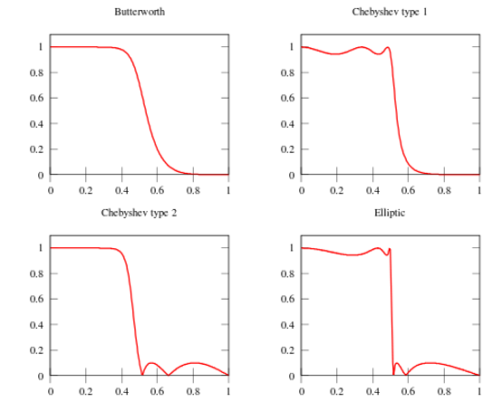
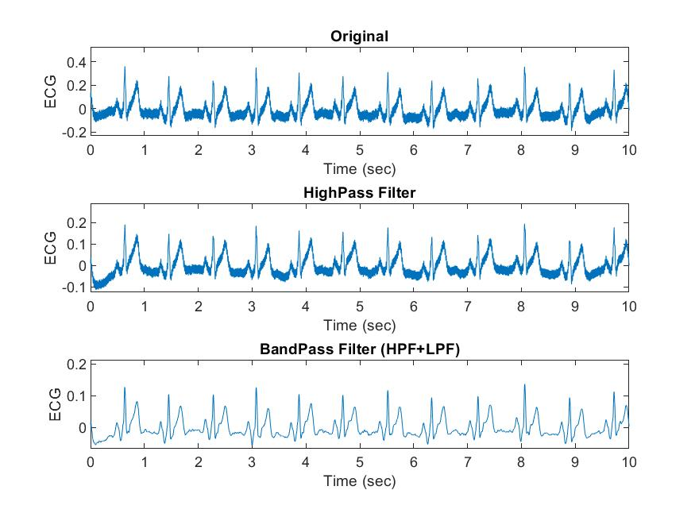
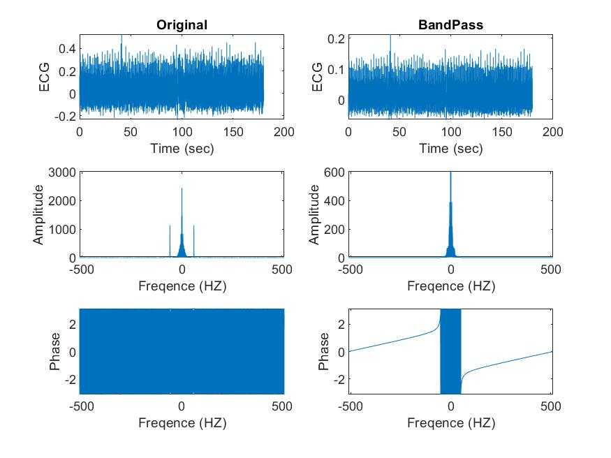
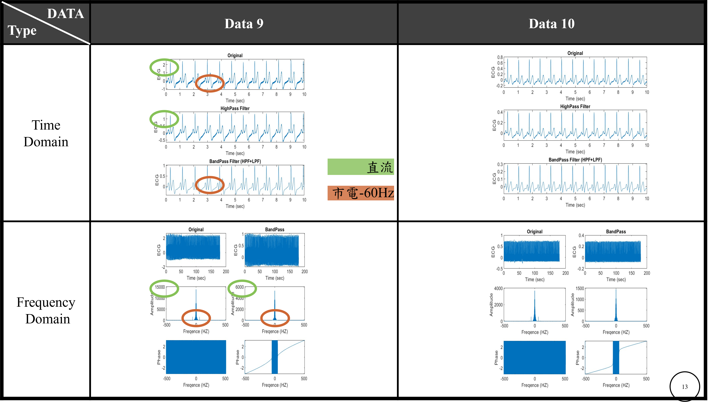

# HW2 - Bandpass Filter

Using `Matlab` to create a Bandpass Filter, and filter DC and 60Hz of electricity.

## [Code - HW1_2.m](HW1_2.m) 

## Bandpass Filter

Using a HighPass Filter and a LowPass Filter instead of Bandpass Filter.

### Kind of Filters



```text
Butterworth
  * 曲線平坦無漣波
  * 衰減慢
Chebyshev I、II
  * 與理想濾波器的頻率響應曲線的誤差最小
  * 衰減快
  * I：通帶波動、II：阻帶波動
Elliptic
  * 在通帶和阻帶的波動相同
```
### Chebyshev I

```text
%% Band Pass Filter
    Rp = 3;
    Rs = 40;

    % High Pass Filter
    Wp = [0.3] / (fs / 2);
    Ws = [0.1] / (fs / 2);
    [N, Wp]=cheb1ord(Wp, Ws, Rp, Rs);
    [B,A] = cheby1(N, Rp, Wp, "high");
    tmps1 = filtfilt(B,A,ECG);
    fprintf("N and Wp of HPF = [%d, %d]\n", N, Wp)

    % Low Pass Filter
    Wp = [50] / (fs / 2);
    Ws = [55] / (fs / 2);
    [N, Wp]=cheb1ord(Wp, Ws, Rp, Rs);
    [B,A] = cheby1(N, Rp, Wp, "low");
    ECG_filter = filtfilt(B,A,tmps1);
    fprintf("N and Wp of LPF = [%d, %d]\n", N, Wp)
```

### Order of Filter

**運算極限**
 
    W = [0.1 0.2 51 55]   
    N and Wp of HPF = [5, 3.906250e-04]  
    N and Wp of LPF = [14, 9.960938e-02]

**適中**

    W = [0.1 0.3 50 55]    
    N and Wp of HPF = [4, 5.859375e-04]  
    N and Wp of LPF = [12, 9.765625e-02]

## Result







## Reference

[wiki](https://zh.wikipedia.org/zh-tw/%E5%88%87%E6%AF%94%E9%9B%AA%E5%A4%AB%E6%BB%A4%E6%B3%A2%E5%99%A8)