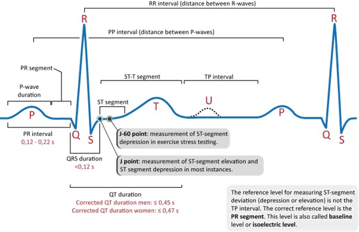
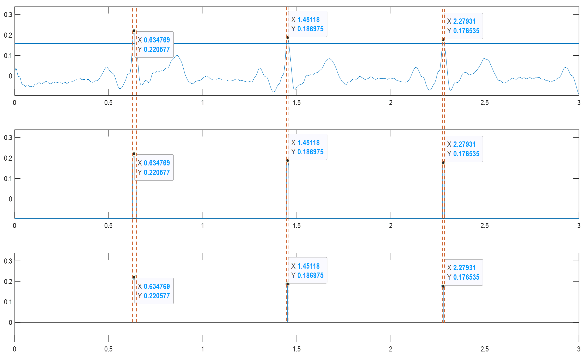
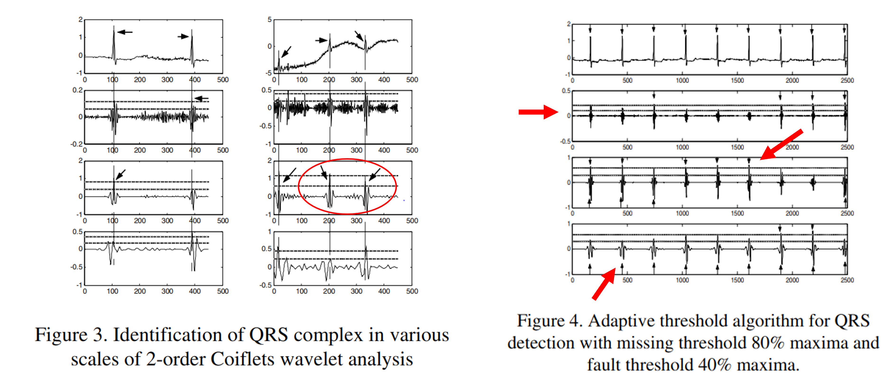

# HW3 - R Peak

Using `Matlab` to find the R Peak of ECG

### QRS Wave



## [Code - HW1_3.m](HW1_3.m) 

### Find the Peak



```text
%% Find the R Peak
function [R_wave, R_peak, R_n] = findRP(ECG,threshold)
    % Init
    R_wave = ECG;
    ECG_min = min(ECG);
    R_wave(ECG<threshold) = ECG_min;
    R_peak = zeros(size(R_wave));
    tmp_on = 0;
    tmp_off = 0;
    % Find the Peak
    for i = 2:length(R_wave)-1
        if R_wave(i) == ECG_min && R_wave(i+1) > ECG_min
            tmp_on = i;   % Find the up pulse  
        elseif R_wave(i) == ECG_min && R_wave(i-1) > ECG_min
            tmp_off = i;  % Find the down pulse
        end
        % Find the local maximum
        if tmp_off > tmp_on  && tmp_on ~= 0 && tmp_off ~= 0
            [peak,index] = max(R_wave(tmp_on:tmp_off));
            R_peak(tmp_on+index-1) = peak;
            tmp_on = 0;
            tmp_off = 0;
        end         
    end
    R_n = find(R_peak~=0);
    R_peak = R_peak(R_n);
end
```

### Adaptive Threshold



```text
%% Adaptive
function  [R_wave, R_peak, R_n_U] = adaptiveRP(ECG,wU,wD)
    % Init
    ECG_max = max(ECG);
    THU = ECG_max*0.8 ;
    THD = ECG_max*0.1;
    % Iteration,
    % Until Number of up line == Nummber of down line
    while(1)  
        [R_wave, R_peak, R_n_U] = findRP(ECG,THU);
        [~, ~, R_n_D] = findRP(ECG,THD);
        if length(R_n_U) ~= length(R_n_D)
            W_UD = THU - THD;
            THU = THU +wU*W_UD;
            THD = THD +wD*W_UD;
        else
            break;
        end      
    end
end
```

## Result


## Reference

[Adaptive Threshold for QRS Complex Detection Based on Wavelet
Transform](https://ieeexplore.ieee.org/stamp/stamp.jsp?arnumber=1616192)