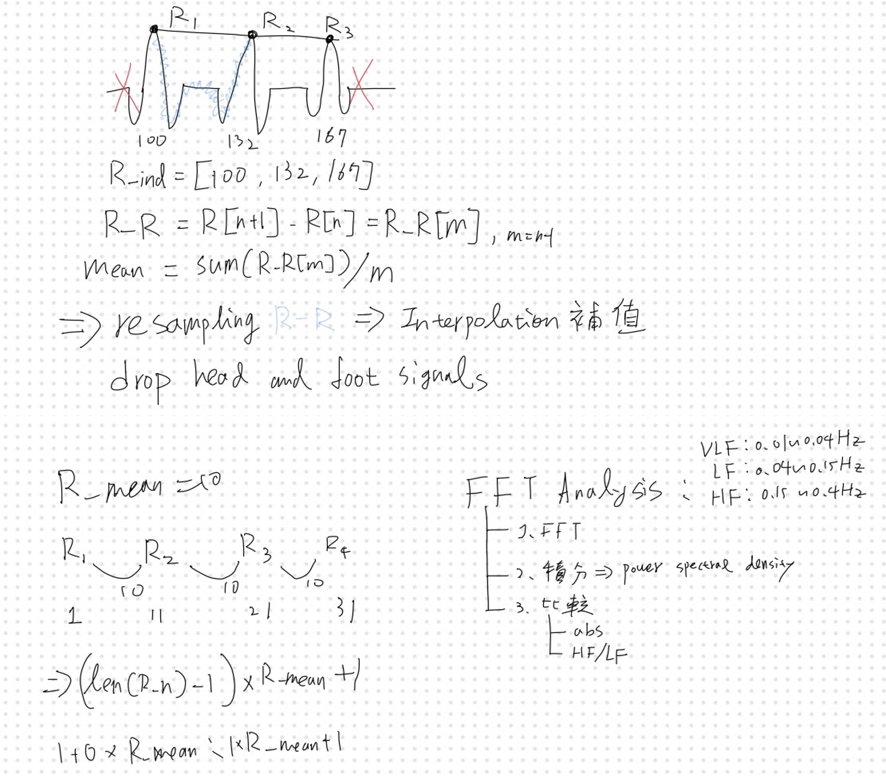
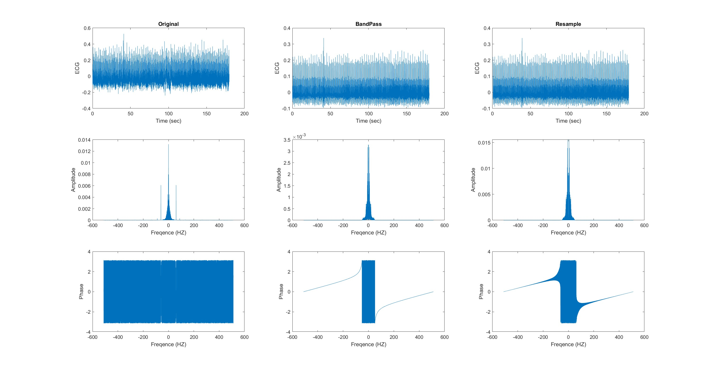

# HW5 Resample & FFT

By filtering the original ECG data and then resampling it, the ECG signal can be transformed into a periodic signal. Fourier analysis can then be applied to observe the frequency, phase, and meaning of various low-frequency signals contained in the ECG.

Using `Matlab` to reasample and FFT analysis.

## Reasmple

* $Mean(R_{peak} to R_{peak})$
* Drop head and foot signal
* Resampling R by R with Interpolation

## FFT

* FFT(signal)
* $Abs()$ for Amplitude
* Normalize with length(signal)

### Power Spectral Density 

* $VLF: 0.01Hz ~ 0.04HZ$
* $LF: 0.04Hz ~ 0.15HZ$
* $HF: 0.15Hz ~ 0.4HZ$

