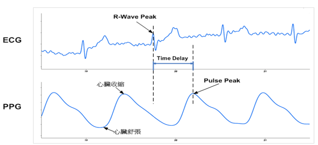
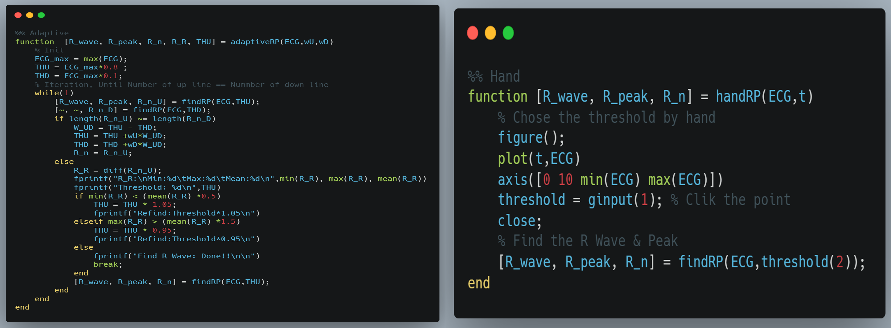

# HW6 Foot of PPG

Capture the R-peaks of the ECG signal and then use the R-peaks to set a searching window backward to find **the lowest point (Foot point) of the PPG** signal.

Using `Matlab` to Find Foot point.

## Method

### Find R-Peaks of ECG

Using ``Adaptive threshold`` to find the R-Peaks of ECG.

### Find Foots of PPG

Using the R-peaks to set a searching window: $index[0:200]$

## Result

