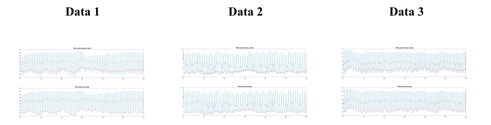

# HW7 Foot of PPG - 2

Finding the foot points of the PPG signal without assistance from the ECG.

## Method

First, use a simple method to locate a reference point for the foot.

Then, based on this reference point, use a searching window to identify the actual foot point.

* Find the foots of PPG
* Adaptive threshold
* Troubleshooting the error point
    
    * too short F_F between the points
    * too long F_F between the points

* Sort the foot points.

## Result

Compared to the previous assignment, it is more challenging to find the foot point solely based on the PPG signal without any additional assistance. This is because the PPG signal is not as steep and distinct at each peak or trough compared to the ECG signal. It is relatively flatter, making it less easily recognizable.

