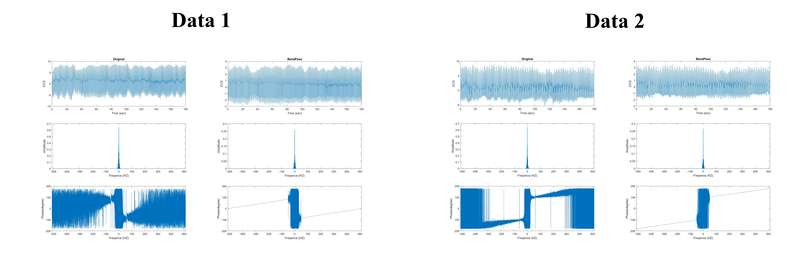
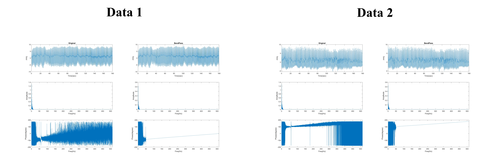
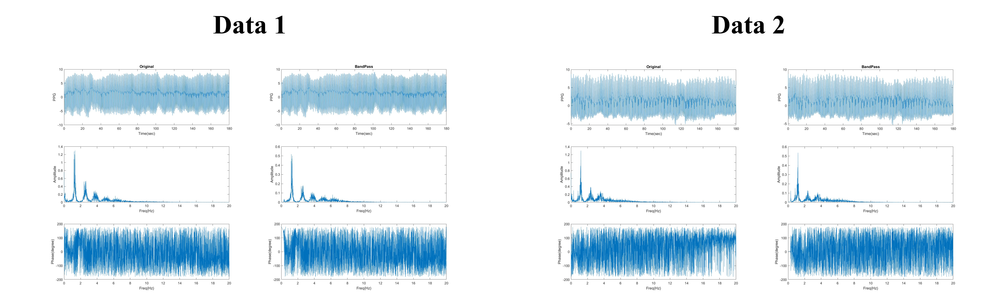

# HW8 FFT of PPG - 1

Frequency analysis of the entire PPG signal is performed, and a comparison is made between two results:
  * Original
  * BandPass

Finally, three ranges are observed and analyzed.

## Method 

### Fourier Analysuis

1. Freqence Range : $[-f : f]$

    ```text
    signals = [PPG; PPG_filter];
    titles = ["Original"; "BandPass"];
    for c=1:2
        subplot(3,2,c)
        plot(t, signals(c,:)); xlabel("Time (sec)"); ylabel("ECG");
        title(titles(c));
        subplot(3,2,c+2)
        plot(f, abs(fftshift(fft(signals(c,:))))/length(signals(c,:))); 
        xlim([min(f),max(f)]);xlabel("Freqence (HZ)"); ylabel("Amplitude");
        subplot(3,2,c+4)
        plot(f, angle(fftshift(fft(signals(c,:))))*180/pi);
        xlim([min(f),max(f)]);;xlabel("Freqence (HZ)"); ylabel("Phase(degree)");
    end
    ```
2. Freqence Range : $[0 : f/2]$

    ```text
    signals = [PPG; PPG_filter];
    titles = ["Original"; "BandPass"];
    for x=1:2
    xdft = fft(signals(x,:));
    xdft = xdft(1:length(PPG)/2+1);
    xdft_norm = xdft/length(xdft);
    freq = 0:fs/length(PPG):fs/2;
    
    subplot(3,2,x)
    plot(t,PPG); xlabel("Time(sec)"); ylabel("PPG");
    title(titles(x))
    subplot(3,2,x+2)
    plot(freq,abs(xdft_norm)); xlabel("Freq(Hz)"); ylabel("Amplitude");
    xlim([min(freq),max(freq)])
    subplot(3,2,x+4)
    plot(freq,angle(xdft)*180/pi); xlabel("Freq(Hz)"); ylabel("Phase(degree)");
    xlim([min(freq),max(freq)])
    end
    ```


## Result

1. Freqence Range : $[-f : f]$

    

2. Freqence Range : $[0 : f/2]$

    

3. Freqence Range : $[0 : 20]$

    From the results, it can be observed that triangular waveforms appear. This is due to the varying lengths of each frequency band, causing periodic features to be spread out. The waveform, which should have converged around $10Hz$, is dispersed within the range of $[8:12]$.

    