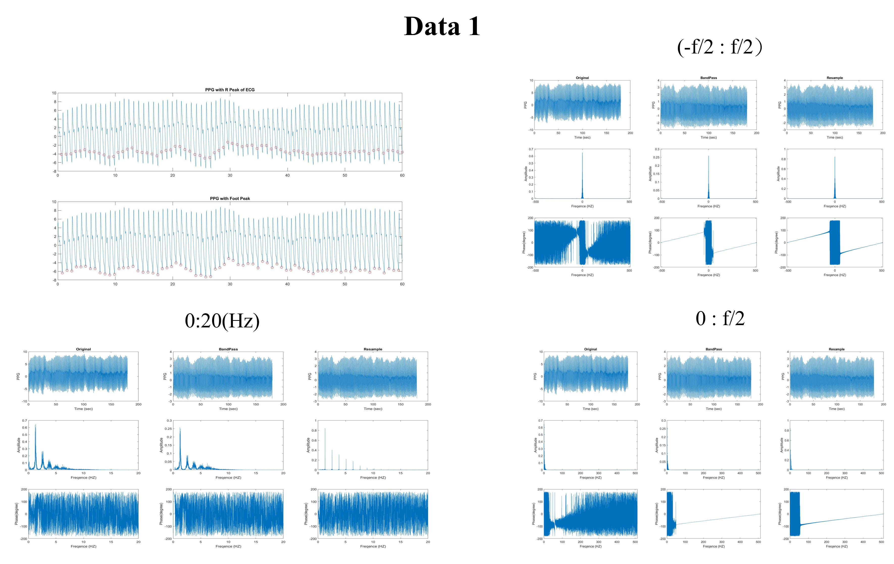
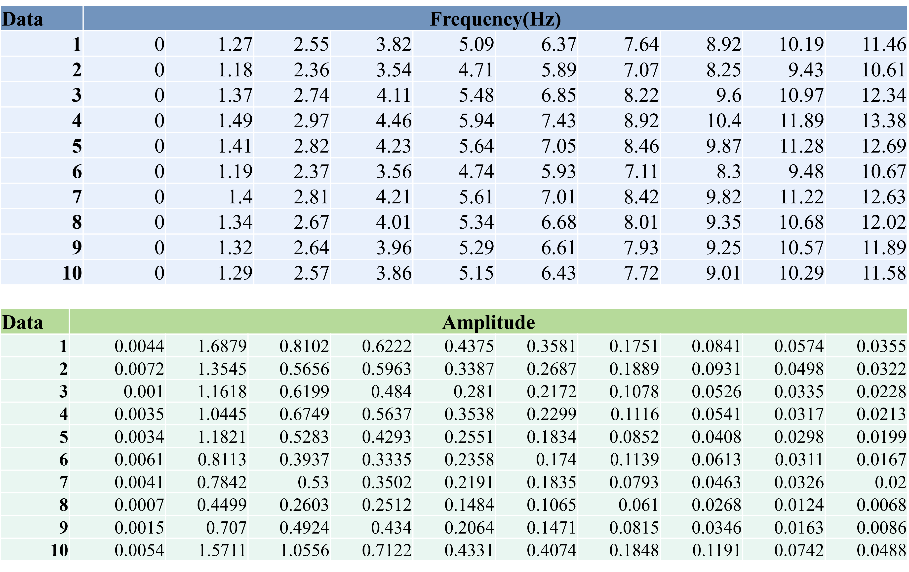

# HW9 FFT of PPG - 2

Frequency analysis of the PPG "single-cycle signal" involves splitting the signal into individual cycles. Each cycle is then resampled to ensure equal signal length. Fourier transform is applied to each individual cycle, and the results are averaged to observe the overall frequency characteristics.

## Method 

1. Resampling 

    ```text
    F_F = diff(F_n);
    F_mean = round(mean(F_F));
    PPG_resample = zeros(1,(length(F_n)-1) * (F_mean)+1);
    F_n_resample = ones(size(F_n));
    t_resample = linspace(t(F_n(1)),t(F_n(end)),size(PPG_resample,2));
    fs_resample = size(PPG_resample,2) / 180;
    f_resample = linspace(-fs/2,fs/2,size(PPG_resample,2));

    for i = 1:length(F_n)-1
        x = F_n(i):F_n(i+1);
        v = PPG_filter(x);
        xq = linspace(F_n(i),F_n(i+1),F_mean+1);
        vq = interp1(x,v,xq,'spline');
        PPG_resample((i-1)*F_mean+1:i*F_mean+1) = vq;
        F_n_resample(i+1) = (i)*F_mean+1;
    end
    ```

2. Fourier Analysis

3. Periodic

    ```text
    result = 0;
    for i=1:length(F_n_resample)-1
    x = PPG_resample(F_n_resample(i):F_n_resample(i+1));
    tt = t_resample(F_n_resample(i):F_n_resample(i+1));
    xdft = fft(x);
    xdft = xdft(1:floor(length(x)/2+1));
    xdft_norm = xdft/length(xdft);
    result = result + xdft_norm;
    freq = 0:fs/length(x):fs/2;
    subplot(3,1,1)
    hold on;
    plot(tt,x)
    subplot(3,1,2)
    hold on;
    stem(freq,abs(xdft_norm)); xlabel("Freq(Hz)"); ylabel("Amplitude");
    xlim([0,15]);
    end
    result = result / (length(F_n_resample)-1);
	subplot(3,1,3)
    stem(freq,abs(result)); xlabel("Freq(Hz)"); ylabel("Amplitude(Mean)");
    xlim([0,15])
    ```


## Result

1. Fourier Analysis

    

2. Total & Periodic

    After Resampling, it can be observed that during Frequency Analysis, the amplitudes converge at the harmonics.

    

3. Harmonic Analysis

    